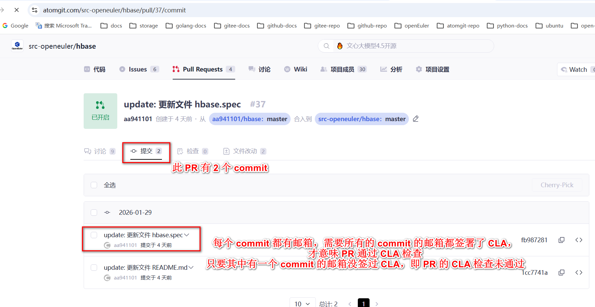
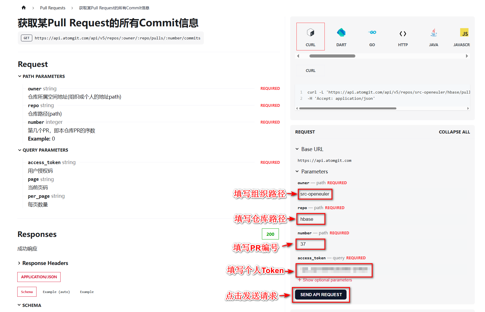
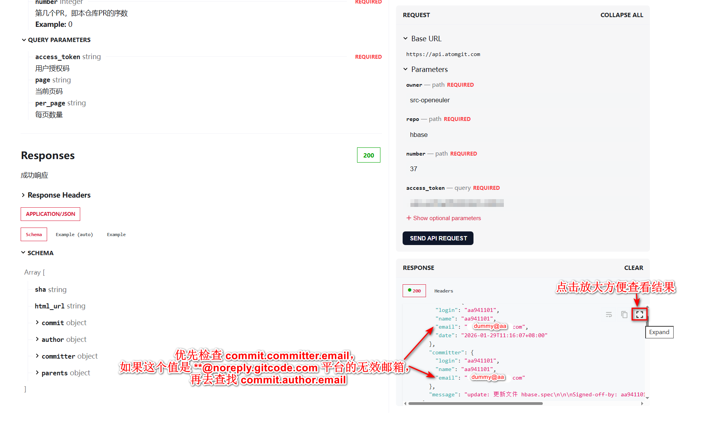
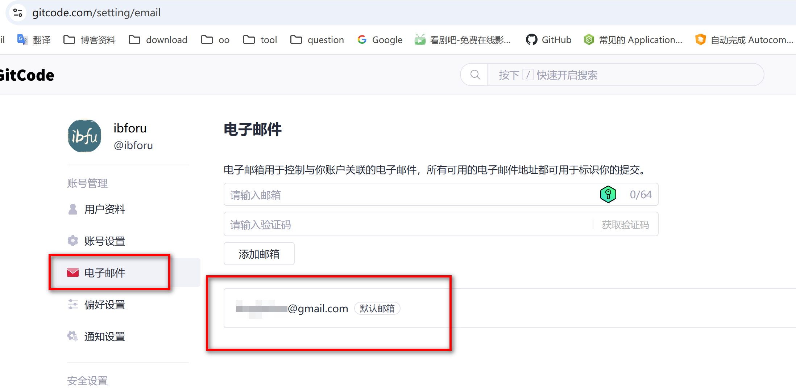
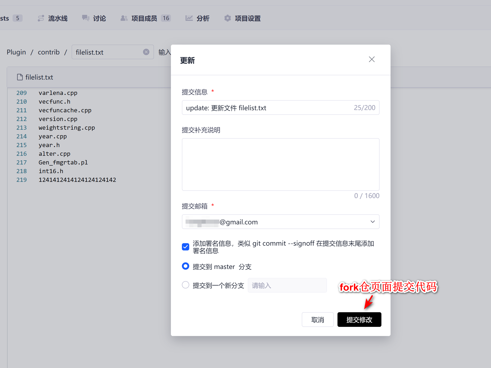
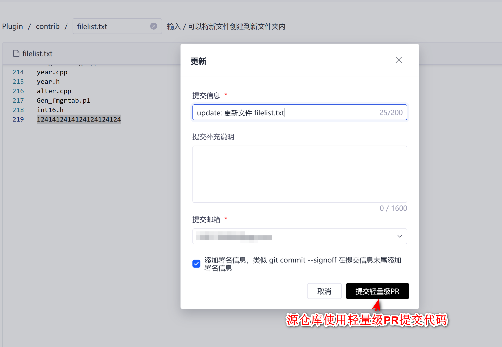

## 指引视频

请点击[链接](https://www.bilibili.com/video/BV12A411o7zY/)观看CLA指引

## 机器人是怎么检查PR是否签署了CLA的

- 机器人是通过检查PullRequest中**所有commit**作者的邮箱是否都签署了CLA来判定PR是否完成了CLA签署

- 如下图所示的一个PR
  

## 怎么查看PR所有commit的作者的邮箱
- 可以通过 AtomGit 平台的 OpenAPI 获取
  - OpenAPI: [获取某Pull Request的所有Commit信息](https://docs.atomgit.com/docs/apis/get-api-v-5-repos-owner-repo-pulls-number-commits)
  
- 使用方法如下：
  - 点击上方API链接打开页面，如下图输入请求参数，然后发送请求
    
    
  - 获取请求结果，如下所示
    


<hr style="border:1px solid gray"/>


## 如何查询一个邮箱是否签署了CLA

请访问这个[网页链接](https://clasign.osinfra.cn/api/v1/individual-signing/6946817fe1b3f3e542b4e2d9?email=)，在链接后拼接要查询的邮箱，返回数据：
```
{
    "data": {
        "type": "",  
        "signed": true, # true是签署了CLA，false是未签过CLA
        "version_matched": true  # true是签署的CLA是最新版的，false是签的CLA不是最新的，需要重新签署
    }
}
```
**signed** 和 **version_matched** 两个字段都是 true 时，即 CLA 签署 OK。


<hr style="border:1px solid gray"/>

## 通过CLA的几种方法
- 如果PR的commit中邮箱是正确的，并且使用上面的接口查询出来确实未签署，需要去[签署CLA](https://clasign.osinfra.cn/sign/696f4f397a5429cd9010ec7a)
- 如果PR的commit中包含平台的默认邮箱、或者包含错误的邮箱（设置错误或者非签署过CLA的邮箱），此时需要参照下面修改 commit 的邮箱
  - **修改完可以再使用平台OpenAPI查询下邮箱是否已经正确**

## 怎么修改commit中的邮箱

#### 第一步： 先确定绑定的邮箱
- 如果是通过 git 提交的PR，可以通过以下终端命令查看配置的邮箱
  - windows: `git config --global --list | findstr email`
  - linux: `git config --global --list | grep email`
- 如果是通过 GitCode 平台页面提交的PR，可以在 https://gitcode.com/setting/email 中查看配置的邮箱（需要登录）
  


#### 第二步： 重置 commit 提交
- 如果是通过 ***平台轻量级PR提交代码*** 或者 ***平台fork仓页面提交代码*** 的方式创建的PR，***<font color=red>需要关闭PR，再次提交代码后，重新创建PR</font>***。
  - fork仓页面提交代码
    
  - 平台轻量级PR提交代码
    

- 如果是通过 git 工具提交代码，然后创建的PR的话，***<font color=red>只需要使用 git 工具重新提交即可</font>***。<br>
  - 如果仅修改**最近一次commit**
    ```shell
    git commit --amend --author="Your Name <new-email@example.com>"
    ```

  - 以下命令适用于PR的 ***N*** 条commit合成一条commit
    ```shell
    # step 1
    git reset --soft head~N    # n 是需要合并的commit的编号，最新提交的commit的编号是1，以此类推
    
    # step 2
    git add *            
    
    # step 3
    git status
    
    # step 4
    git commit -m "..."   # 重新提交，提交信息需要更新
    
    # step 5
    git push -f
    ```

#### 第三步： 进入 PR 页面，评论 **`/check-cla`** 触发 CLA 重新检查

#### 第四步： 确认 CLA 签署是否通过： CLA yes 标签是否打上
