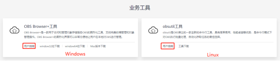
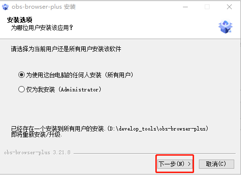
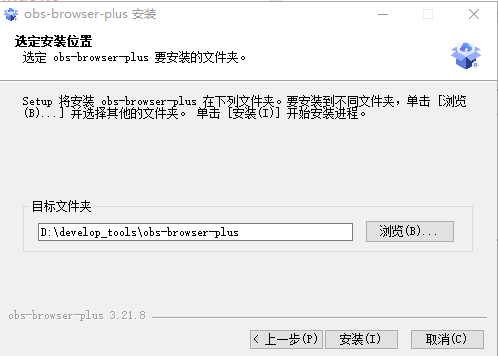
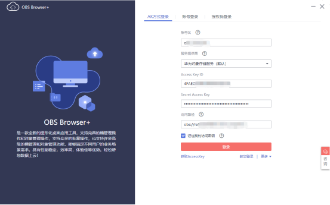
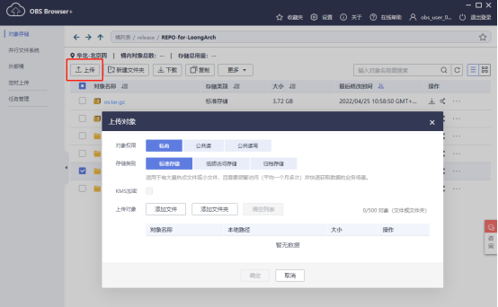
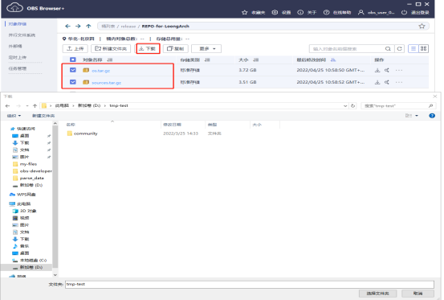
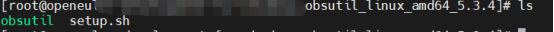
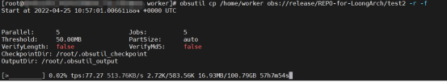
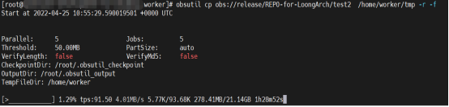
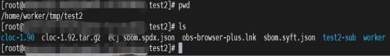

# obs-developer-tools安装使用手册   
## 一、安装地址   
工具下载地址：https://developer.huaweicloud.com/tools#section-1   
  
详细操作流程请点击：用户指南   

## 二、Windows平台   
### 1、安装指南  
下载obs-browser-plus Setup 3.21.8后直接下一步安装即可   
   
   

### 2、Windows操作指南   
#### ①、登录   
    

#### ②、上传文件或文件夹   
登录OBS Browser+。  
单击想要上传文件或文件夹的桶。  
单击“上传”，并选择“添加文件”或“添加文件夹”。  
   

#### ③、下载文件或文件夹   
登录OBS Browser+。     
选中待配置的桶，选中需要下载的文件或文件夹后，单击“下载”。   
OBS对象存储支持批量下载多个文件和文件夹，按住“Ctrl”或“Shift”同时选中待下载的文件	或文件夹即可，同时支持“Ctrl+A”全选操作。操作习惯与Windows操作系统上的操作习惯保持一致。   
  

## 三、Linux平台   
### 1、安装指南   
#### ①、obsutil工具下载   
打开命令行终端，执行wget命令下载obsutil工具。   
wget https://obs-community.obs.cn-north-1.myhuaweicloud.com/obsutil/current/obsutil_linux_amd64.tar.gz   

#### ②、解压   
在软件包所在目录，执行以下解压命令。   
tar -xzvf obsutil_linux_amd64.tar.gz   

#### ③、增加obsutil文件可执行权限   
进入obsutil所在目录，执行以下命令，为obsutil增加可执行权限。   
cd obsutil_linux_amd64_5.x.x   
chmod 755 obsutil   

#### ④、拷贝obsutil、setup.sh到/usr/bin目录   
拷贝obsutil_linux_amd64_5.x.x目录下文件obsutil、setup.sh到/usr/bin目录下   
   
cp xx/obsutil_linux_amd64_5.x.x/obsutil  /usr/bin/   
cp xx/obsutil_linux_amd64_5.x.x/setup.sh  /usr/bin/   

### 2、初始化配置    
使用永久AK、SK进行初始化配置   
obsutil config -i=ak -k=sk -t=token -e=endpoint   
示例：  
obsutil config -i=aabbcc -k=xxyyzz -e=obs.cn-north-4.myhuaweicloud.com   

### 3、操作指南    
#### ①、文件上传    
运行obsutil cp /temp/test.txt obs://bucket-test/test.txt命令，将本地test.txt文件上传至bucket-test桶中。    
命令：obsutil cp /temp/test.txt obs://bucket-test/test.txt   

Parallel:      5                   Jobs:          5   
Threshold:     52428800            PartSize:      5242880    
Exclude:                           Include:    
VerifyLength:  false               VerifyMd5:     false   
CheckpointDir: /temp/.obsutil_checkpoint   

test.txt:[==============================================] 100.00% 48.47 KB/s 0s   
Upload successfully, 4.44KB, /temp/test.txt --> obs://bucket-test1/test.txt   

#### ②、文件下载   
运行obsutil cp obs://bucket-test/test.txt /temp/test1.txt命令，将bucket-test桶中的test.txt对象下载至本地。   
命令：obsutil cp obs://bucket-test/test.txt /temp/test1.txt   

Parallel:      5                   Jobs:          5   
Threshold:     52428800            PartSize:      5242880   
Exclude:                           Include:   
VerifyLength:  false               VerifyMd5:     false   
CheckpointDir: /temp/.obsutil_checkpoint   

test.txt:[=============================================] 100.00% 775.52 KB/s 0s   
Download successfully, 4.44KB, obs://bucket-test1/test.txt --> /temp/test1.txt   

#### ③、文件夹上传   
上传文件夹至release桶REPO-for-LoongArch/test2目录中。   
命令：obsutil cp /home/worker obs://release/REPO-for-LoongArch/test2 -r -f   
   

#### ④、文件夹下载   
从release桶REPO-for-LoongArch目录中下载文件夹test2至本地/home/worker/tmp/目录。   
命令：obsutil cp obs://release/REPO-for-LoongArch/test2  /home/worker/tmp -r -f   
   

#### ⑤、查看下载数据   
   
