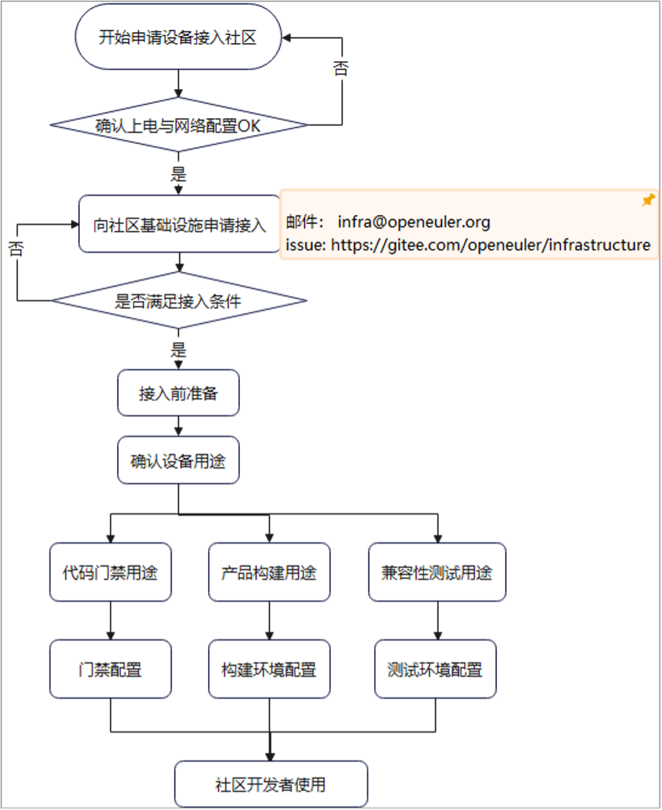
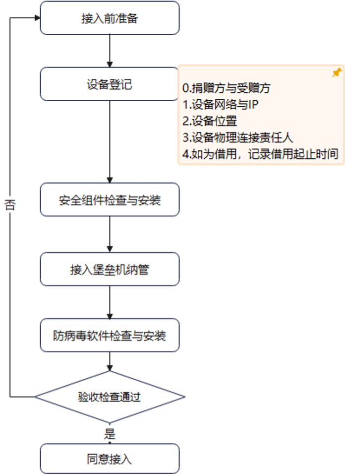

# openEuler社区基础设施资源贡献指南

随着openEuler社区的发展，openEuler及社区各创新项目所需适配的硬件设备和环境架构、型号越来越多，社区基础设施需要接入更多类型的资源以便为开发者提供日益增多的硬件种类上高质量适配、调优的软件产品。openEuler社区秉承共建共享的理念，积极接收各社区参与者所贡献的基础设施资源，用于为openEuler社区提供南北向兼容性测试、代码门禁检查、软件包及操作系统镜像构建、软件包仓库等服务。同时，作为基础软件根社区，openEuler社区还积极与高校合作，主持、参与各类课程、竞赛、实习、实践等基础软件人才培养计划，社区基础设施资源同样可能被用于此类人才培养活动。

openEuler社区基础设施由Infrastructure SIG管理和运维。openEuler社区将为所有为openEuler社区提供基础设施资源的单位和个人在官方网站进行致谢。

## 资源贡献

openEuler社区目前可接受`虚拟机`资源贡献，设备接入方案按照不同用途进行配置；接入前经过社区基础设施审核备案，统一管理；审批可以由设备贡献者发起，可通过邮件列表方式（发送邮件至： infra@openeuler.org）或社区[ISSUE方式提交](https://gitee.com/openeuler/infrastructure/issues)。

基础设施确认设备是否满足接入条件：

1. 贡献的资源类型
2. 网络连接是否通畅；
3. 设备实际信息是否与申请信息一致；
4. 承诺的资源贡献时长；

所贡献的资源应能保证申请中所承诺的贡献时长，若要终止贡献，需通过邮件列表或ISSUE方式与社区基础设施团队进行沟通，同时给与社区基础设施团队72小时的业务迁移时间用于迁移和释放运行在该资源上的业务。

## 接入准备

社区接入前需要有一些列准备动作，具体包括设备登记、安全组件检查与安装、接入堡垒机纳管、防病毒软件检查与安装；待完成所有准备动作并检验合格后再实施设备配置与使用。

## 接入使用

设备接入后，按照不同用途对接进行相关，如图1所示：

1. 代码门禁检查
2. 产品包构建
3. 兼容性测试

配置过程由基础设施团队、捐赠者和(或)使用者共同完成。

## 资源维护

备配置变更处理与设备监管由社区基础设施团队负责，包括但不限于设备系统升级、系统补丁安装、系统安全防护、设备使用监控等；

## 其他问题

如有其他问题，欢迎通过邮件列表（发送邮件至： infra@openeuler.org）或ISSUE方式与社区基础设施团队进行交流。
