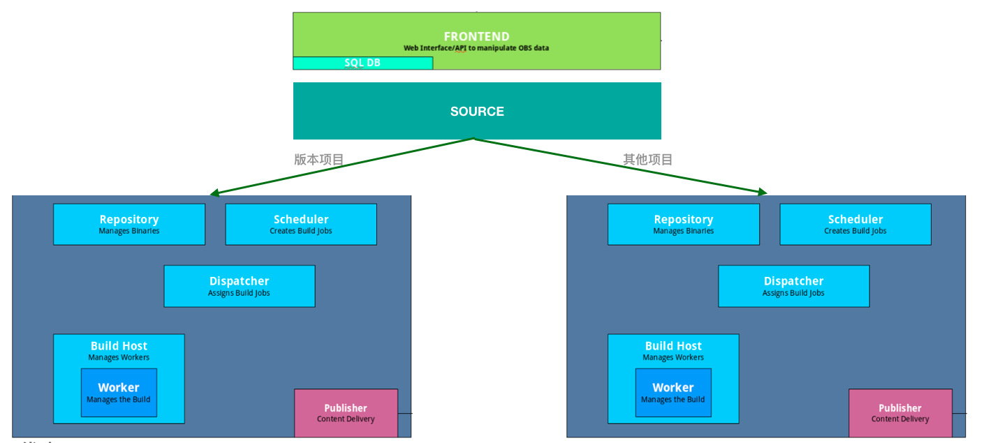

# OBS 部署说明
我们使用open build service提供的开源方案部署了 openEuler自己的包持续构建平台，并且参照open build service的[官方建议](https://openbuildservice.org/help/manuals/obs-admin-guide/obs.cha.installation_and_configuration.html)，按照下面的方式部署了集群:
 
这里面包含的组件有:
1. 前端(frontend): 部署了服务的前端组件，包括数据库，网站等。
2. 源代码端(source): 部署了服务的代码仓库组件。
3. 主后端(backend): 部署了一套完整的后端组件，负责除去home project外，其他项目的调度，构建，发布。
4. home项目后端(home-backend): 部署了一套完整的后端组件，负责所有home project的调度，构建，发布。
5. 很多x86 aarch64的worker，这些worker大部分只服务于主后端组件，少量服务于home项目后端。

**注意**: 部署过程中，我们使用的一些配置文件，是存放在OBS上的(公开读),具体地址:
https://openeuler.obs.cn-south-1.myhuaweicloud.com:443/infrastructure
后续调整的时候需要同步更新。
## 组件介绍
### 前提
假设我们四台机器均在一个互通的子网内，他们之间可通过子网IP访问，IP具体信息如下:
1. frontend: 172.16.1.81
2. source: 172.16.1.89
3. backend: 172.16.1.95
4. home-backend: 172.16.1.84

**注意**: 如果机器在不同的子网内，需要保证服务端口开放。

## 部署
### 前端(Frontend)
1. 要求

我们是基于官方提供的all-in-one镜像构建后，拆分服务的，所以需要确保你的镜像是: OpenSUSE OBS 2.10 ISO image [here](https://openbuildservice.org/download/)

2. 安装说明
`tf/startup/frontend.sh`文件，提供了基本的执行脚本，用于拉起前端服务，拷贝到机器后，执行命令如下:
```bash
./frontend.sh 172.16.1.81 172.16.1.89 172.16.1.95 172.16.1.84
```
我们可以通过下面的指令确认需要的服务已经起来。
```bash
systemctl list-units | grep -E 'obs|memcached|mariadb|apache2'
```
the output would be like:
```bash
apache2.service                                                                loaded active running   The Apache Webserver
mariadb.service                                                                loaded active running   MySQL server
memcached.service                                                              loaded active running   memcached daemon
obs-clockwork.service                                                          loaded active running   Open Build Service Clockwork Daemon
obs-delayedjob-queue-consistency_check.service                                 loaded active running   Open Build Service DelayedJob Queue: consistency_check
obs-delayedjob-queue-default.service                                           loaded active running   Open Build Service DelayedJob Queue: default
obs-delayedjob-queue-issuetracking.service                                     loaded active running   Open Build Service DelayedJob Queue: issuetracking
obs-delayedjob-queue-mailers.service                                           loaded active running   Open Build Service DelayedJob Queue: mailers
obs-delayedjob-queue-project_log_rotate.service                                loaded active running   Open Build Service DelayedJob Queue: project_log_rotate
obs-delayedjob-queue-quick@0.service                                           loaded active running   Open Build Service DelayedJob Queue Instance: quick
obs-delayedjob-queue-quick@1.service                                           loaded active running   Open Build Service DelayedJob Queue Instance: quick
obs-delayedjob-queue-quick@2.service                                           loaded active running   Open Build Service DelayedJob Queue Instance: quick
obs-delayedjob-queue-releasetracking.service                                   loaded active running   Open Build Service DelayedJob Queue: releasetracking
obs-delayedjob-queue-staging.service                                           loaded active running   Open Build Service DelayedJob Queue: staging
obs-sphinx.service                                                             loaded active running   Open Build Service Sphinx Search Daemon
obsstoragesetup.service                                                        loaded active exited    OBS storage setup
system-obs\x2ddelayedjob\x2dqueue\x2dquick.slice                               loaded active active    system-obs\x2ddelayedjob\x2dqueue\x2dquick.slice
obs-api-support.target                                                         loaded active active    Open Build Service API Support Daemons
```
同时 hosts文件会添加集群内其他机器的host ip映射信息:
```$xslt
172.16.1.81 build.openeuler.org
172.16.1.89 source.openeuler.org
172.16.1.95 backend.openeuler.org
172.16.1.84 home-backend.openeuler.org
```
### 源代码端(Source)
1. 要求

我们是基于官方提供的all-in-one镜像构建后，拆分服务的，所以需要确保你的镜像是: OpenSUSE OBS 2.10 ISO image [here](https://openbuildservice.org/download/)

Source机器使用到的配置文件BSConfig.pm(tf/startup/BSConfig.pm)，如果修改，需要在执行脚本前，同步到OBS。

2. 安装说明
`tf/startup/source.sh`文件，提供了基本的执行脚本，用于拉起源代码服务，拷贝到机器后，执行命令如下:
```bash
./source.sh 172.16.1.81 172.16.1.89 172.16.1.95 172.16.1.84 /dev/vdb
```
`/dev/vdb`提前准备的磁盘，由于source机器会用来存储所有的代码，建议配置一个至少2T空间的SSD磁盘。

我们可以通过下面的指令确认需要的服务已经起来。
```bash
systemctl list-units | grep obs
```
```bash
obsdeltastore.service                                                          loaded active running   OBS deltastore daemon
obsservicedispatch.service                                                     loaded active running   OBS source service dispatcher
obssrcserver.service                                                           loaded active running   OBS source repository server
obsstoragesetup.service                                                        loaded active exited    OBS storage setup
```
同时 hosts文件会添加集群内其他机器的host ip映射信息:
```$xslt
172.16.1.81 build.openeuler.org
172.16.1.89 source.openeuler.org
172.16.1.95 backend.openeuler.org
172.16.1.84 home-backend.openeuler.org
```

### 主后端(backend)
1. 要求

我们是基于官方提供的all-in-one镜像构建后，拆分服务的，所以需要确保你的镜像是: OpenSUSE OBS 2.10 ISO image [here](https://openbuildservice.org/download/)
Backend机器使用到的配置文件BSConfig.pm(tf/startup/BSConfig.pm)，如果修改，需要在执行脚本前，同步到OBS。

2. 安装说明
`tf/startup/backend.sh`文件，提供了基本的执行脚本，用于拉起源代码服务，拷贝到机器后，执行命令如下:
```bash
./backend.sh 172.16.1.81 172.16.1.89 172.16.1.95 172.16.1.84 361466436 /dev/vdb
```
`/dev/vdb`提前准备的磁盘，由于backend机器会用来存储所有的构建包，建议配置一个至少4T空间的SAS磁盘。
`361466436`:配置的repoID，需要跟Source机器上的repoID保持一致，当在Source机器上执行脚本时，界面会显示Source机器的repoID。

我们可以通过下面的指令确认需要的服务已经起来。
```bash
systemctl list-units | grep obs -e "obs|apache2"
```
the output would include:
```bash
apache2.service                                                                loaded active running   The Apache Webserver
obsdispatcher.service                                                          loaded active     running         OBS job dispatcher daemon
obsdodup.service                                                               loaded active     running         OBS dodup, updates download on demand metadata
obspublisher.service                                                           loaded active     running         OBS repository publisher
obsrepserver.service                                                           loaded active     running         OBS repository server
obsscheduler.service                                                           loaded active     exited          OBS job scheduler
obsservice.service                                                             loaded active     running         OBS source service server
obssignd.service                                                               loaded active     running         LSB: start the gpg sign daemon
obssigner.service                                                              loaded active     running         OBS signer service
obswarden.service                                                              loaded active     running         OBS warden, monitors the workers
```
同时 hosts文件会添加集群内其他机器的host ip映射信息:
```$xslt
172.16.1.81 build.openeuler.org
172.16.1.89 source.openeuler.org
172.16.1.95 backend.openeuler.org
172.16.1.84 home-backend.openeuler.org
```

### Home project后端(home-backend)
1. 要求

我们是基于官方提供的all-in-one镜像构建后，拆分服务的，所以需要确保你的镜像是: OpenSUSE OBS 2.10 ISO image [here](https://openbuildservice.org/download/)
Home-backend机器使用到的配置文件Home_BSConfig.pm(tf/startup/Home_BSConfig.pm)，如果修改，需要在执行脚本前，同步到OBS。

2. 安装说明
`tf/startup/home-backend.sh`文件，提供了基本的执行脚本，用于拉起源代码服务，拷贝到机器后，执行命令如下:
```bash
./home-backend.sh 172.16.1.81 172.16.1.89 172.16.1.95 172.16.1.84 361466436 /dev/vdb
```
`/dev/vdb`提前准备的磁盘，由于backend机器会用来存储所有的构建包，建议配置一个至少2T空间的SSD磁盘。
`361466436`:配置的repoID，需要跟Source机器上的repoID保持一致，当在Source机器上执行脚本时，界面会显示Source机器的repoID。

我们可以通过下面的指令确认需要的服务已经起来。
```bash
systemctl list-units | grep obs -e "obs|apache2"
```
the output would include:
```bash
apache2.service                                                                loaded active running   The Apache Webserver
obsdispatcher.service                                                          loaded active     running         OBS job dispatcher daemon
obsdodup.service                                                               loaded active     running         OBS dodup, updates download on demand metadata
obspublisher.service                                                           loaded active     running         OBS repository publisher
obsrepserver.service                                                           loaded active     running         OBS repository server
obsscheduler.service                                                           loaded active     exited          OBS job scheduler
obsservice.service                                                             loaded active     running         OBS source service server
obssignd.service                                                               loaded active     running         LSB: start the gpg sign daemon
obssigner.service                                                              loaded active     running         OBS signer service
obswarden.service                                                              loaded active     running         OBS warden, monitors the workers
```
同时 hosts文件会添加集群内其他机器的host ip映射信息:
```$xslt
172.16.1.81 build.openeuler.org
172.16.1.89 source.openeuler.org
172.16.1.95 backend.openeuler.org
172.16.1.84 home-backend.openeuler.org
```

### 工作机器(worker)

1. 要求
目前openEuler支持x86的aarch642种平台的构建，我们使用的worker机器对应的操作系统如下：
1. x86(centos 7.6)，对应的初始化脚本是`worker.sh`
2. aarch(euleros 2.x),对应的初始化脚本是`worker_centos.sh`

2. 安装说明
worker机器在高并发的情况下，对磁盘IO占用比较高，建议挂载SSD或者直接挂载内存作为worker的工作目录(/var/cache/obs/worker)，如果是磁盘，直接执行命令即可:
```$xslt
./worker.sh 172.16.1.81 172.16.1.89 172.16.1.95 172.16.1.84 /dev/vdb
```
如果是使用内存，如要提前准备好挂载的内存:
```$xslt
mkdir -p /var/cache/obs/worker && echo "tmpfs /var/cache/obs/worker tmpfs   nodev,nosuid,noexec,nodiratime,size=200G   0 0" >> /etc/fstab && reboot
```
然后再执行脚本:
```$xslt
./worker.sh 172.16.1.81 172.16.1.89 172.16.1.95 172.16.1.84
```
我们可以通过下面的指令确认需要的服务已经起来。
```bash
systemctl list-units | grep obs
```
the output would include:
```bash
obsworker.service                                                              loaded active running   LSB: Open Build Service worker
```
obsworker服务的配置文件在: /etc/sysconfig/obs-server, 其中重点的参数包括:
1. `OBS_SRC_SERVER`: 指向source server。
2. `OBS_REPO_SERVERS`: 指向我们的后端服务，配置配置多个后端地址，以空格隔开，表明同时注册给多个后端。
3. `OBS_WORKER_INSTANCES`: worker的实例数。
4. `OBS_WORKER_JOBS`：每个worker的cpu数，系统计算根据当前机器的*核数/实例数*计算得来。
5. `OBS_WORKER_DIRECTORY`: worker的工作目录，默认指向`/var/cache/obs/worker`。

同时 hosts文件会添加集群内其他机器的host ip映射信息:
```$xslt
172.16.1.81 build.openeuler.org
172.16.1.89 source.openeuler.org
172.16.1.95 backend.openeuler.org
172.16.1.84 home-backend.openeuler.org
```

## 其他
集群的包和代码准备，请参考`download_packages`和`download_package_codes`目录中的指导文件，完成后可以在source机器中，执行下面的指令用于触发第一次构建:
```$xslt
for rpmn in `osc ls openEuler:Mainline`;do osc service remoterun openEuler:Mainline $rpmn;done
```
